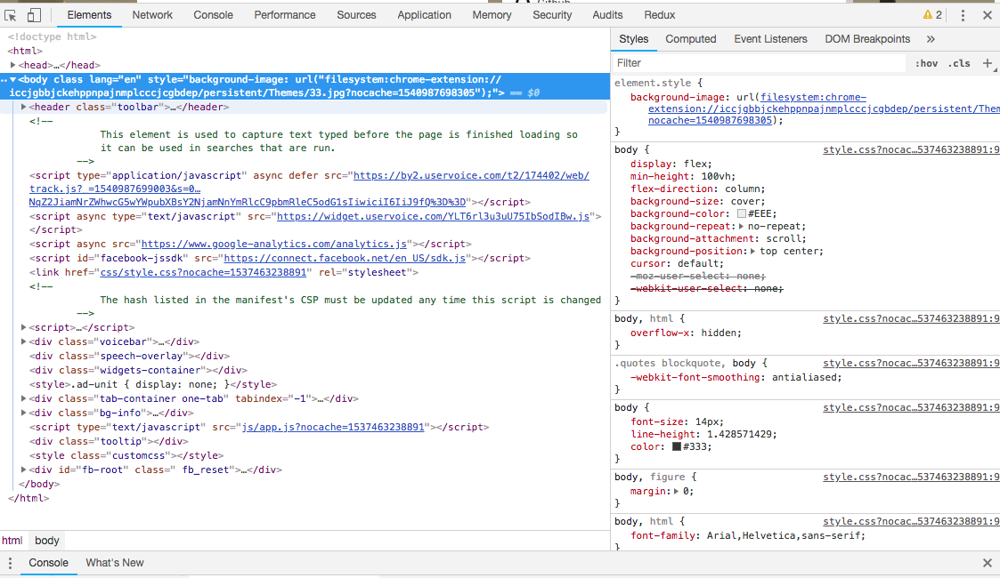

## Chrome Dev Tools

### Basic Tools

- option cmd J to open dev tools
- arrow btn: select element
- screen btn: responsive / adjust screen size
- elements tab: shows source code, and related css. CSS will show source file.
- ··· menu in elements tab to change attributes and state to :hover, :focus, ect
- in 'styles', click colors to bring up color picker tool 
